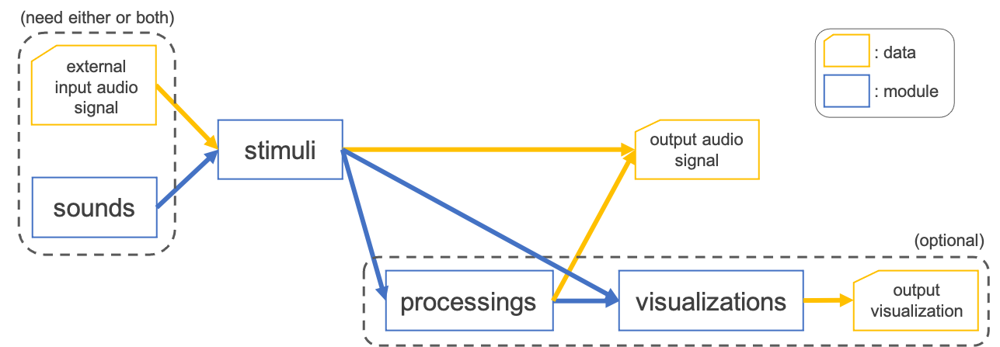

.. _configuration:

################
Customize Output
################

You can generate any type of stimulus by customizing configuration file.
Before explaining how to set up the configuration, we will first introduce the toolkit architecture.

================================
Overview of toolkit architecture
================================

In ASPEN, the output is defined by four module:

- :ref:`sounds <aspen.sounds>`
- :ref:`stimuli <aspen.stimuli>`
- :ref:`processings <aspen.processings>`
- :ref:`visualizations <aspen.visualizations>`

A series of each module is proceeded sequentially and the processing flow is illustrated schematically in the following figure:

--------

--------

A brief descriptions of each module are:

.. list-table::
   :widths: 10 80 10
   :header-rows: 1

   * - Module
     - Description
     - Reference
   * - **sounds**
     - Define a generation of fundamental sound signal (e.g. pure tone, noise) inputted to **stimuli**
     - :ref:`aspen.sounds`
   * - **stimuli**
     - Define a transformation of input signal specified by external signal and/or generated signal from **sounds**
     - :ref:`aspen.stimuli`
   * - **processings**
     - Define a postprocessing (e.g. applying a ramp function) to finalize an auditory stimulus (optional)
     - :ref:`aspen.processings`
   * - **visualizations**
     - Define a visualization of output stimulus (optional)
     - :ref:`aspen.visualizations`

=======================
Customize configuration
=======================

In order to configure the aforementioned modules, you need to set up a YAML file.

---------------------
Customize **stimuli**
---------------------

For example, as shown in :ref:`previous section <run_with_conf>`, we could generate an iterated rippled noise (IRN) with :math:`F0=1000[Hz]` based on the configuration file:

.. code-block:: yaml
  :caption: iterated_rippled_noise.conf

  # general setting
  stimulus-module: iterated_rippled_noise
  samp-freq: 48000
  outdir: "data/iterated_rippled_noise"
  suffix: iter8_delay1
  
  # sounds setting
  sound-generation-pipeline: [colored_noise]
  colored-noise-color: [white]
  colored-noise-duration: [1000]
  colored-noise-num-signals: 1
  
  # stimulus setting
  num-iteration: 8
  delay: 1
  
  # postprocessings setting
  postprocess-pipeline: [declip, apply_ramp]
  declip-thres: 1
  apply-ramp-duration: 5
  apply-ramp-wfunction: hann
  apply-ramp-position: both
  
  # visualization
  visualization-pipeline: [waveform, spectrogram, spectrum, mps]
  visualization-outdir: "data/iterated_rippled_noise/vis"

In this example, the settings of each module correspond to each section except for basic I/O configuration (such as ``samp-freq`` and ``outdir``).
For example, you can change the :math:`F0` of IRN by overwriting the ``delay`` parameter:

.. code-block:: yaml
  :caption: iterated_rippled_noise.conf

  # general setting
  stimulus-module: iterated_rippled_noise
  samp-freq: 48000
  outdir: "data/iterated_rippled_noise"
  suffix: iter8_delay2 # <- change the output name
  
  # sounds setting
  sound-generation-pipeline: [colored_noise]
  colored-noise-color: [white]
  colored-noise-duration: [1000]
  colored-noise-num-signals: 1
  
  # stimulus setting
  num-iteration: 8
  delay: 2  # <- change the delay parameter
  
  # postprocessings setting
  postprocess-pipeline: [declip, apply_ramp]
  declip-thres: 1
  apply-ramp-duration: 5
  apply-ramp-wfunction: hann
  apply-ramp-position: both
  
  # visualization
  visualization-pipeline: [waveform, spectrogram, spectrum, mps]
  visualization-outdir: "data/iterated_rippled_noise/vis"

Then run with the configuration:

.. code-block:: bash

  cd egs
  . ./path.sh
  generate.py --conf conf/iterated_rippled_noise.conf
  ls data/iterated_rippled_noise
  # you can find data/iterated_rippled_noise/iter8_delay2.wav

You can also override parameters by command-line arguments:

.. code-block:: bash

  cd egs
  . ./path.sh
  generate.py --conf conf/iterated_rippled_noise.conf --delay 3 --suffix iter8_delay3
  ls data/iterated_rippled_noise
  # you can find data/iterated_rippled_noise/iter8_delay3.wav

You can show the help message:

.. code-block:: bash

  generate.py --stimulus-module iterated_rippled_noise --help
  # need to specify the --stimulus-module arguments

----------------------------------------
Customize **sounds** and **processings**
----------------------------------------

**sounds** and **processings** modules are introduced to pipeline of generation and transformation, respectively.
In other words, **sounds** generate a list of fundamental sound signals and **processings** apply a list of transforms sequentially.

^^^^^^^^^^^^^^^^^^^
**sounds** pipeline
^^^^^^^^^^^^^^^^^^^

**sounds** pipeline is defined by sound section of configuration file such as:

.. code-block:: yaml

  # sounds setting
  sound-generation-pipeline: [colored_noise]
  colored-noise-color: [white]
  colored-noise-duration: [1000]
  colored-noise-num-signals: 1

This example will generate one of the white noise with 1000ms internally in order to input to **stimuli** module (see also :py:class:`aspen.sounds.colored_noise`).
Some **stimuli** modules may require more than one signal, so multiple **sounds** settings are needed for that.
For example, in the case of auditory streaming that consists of *A-B-A*, two tones are needed and are defined by:

.. code-block:: yaml

  # sounds setting
  sound-generation-pipeline: [pure_tone]
  pure-tone-num-signals: 2
  pure-tone-duration: [50, 50]
  pure-tone-freq: [315, 400]

Here, two pure tones with 50ms are produced at frequencies of 315Hz (for *A tone*) and 400Hz (for *B tone*) (see also :py:class:`aspen.sounds.pure_tone`).
If you would design to set *A tone* as a harmonic complex tone instead of the pure tone above, the configuration is:

.. code-block:: yaml

  # sounds setting
  sound-generation-pipeline: [complex_tone, pure_tone]
  complex-tone-duration: [50]
  complex-tone-fundamental-freq: [315]
  complex-tone-num-harmonics: [5]
  complex-tone-first-harmonic-freq: [315]
  complex-tone-num-signals: 1
  pure-tone-num-signals: 1
  pure-tone-duration: [50]
  pure-tone-freq: [400]

where the complex tone has the duration of 50ms, 5 harmonics and :math:`F0=315[Hz]` (see also :py:class:`aspen.sounds.complex_tone`).

^^^^^^^^^^^^^^^^^^^^^^^^
**processings** pipeline
^^^^^^^^^^^^^^^^^^^^^^^^

**processings** pipeline is defined by postprocessing section of configuration file such as:

.. code-block:: yaml

  # postprocessings setting
  postprocess-pipeline: [declip, apply_ramp]
  declip-thres: 1
  apply-ramp-duration: 5
  apply-ramp-wfunction: hann
  apply-ramp-position: both

This example will apply :py:class:`declipping <aspen.processings.declip>` and :py:class:`ramp function <aspen.processings.apply_ramp>` to output of **stimuli** module sequentially.

.. note::
   
  In ASPEN, since the value range of signal is processed between 1.0 and -1.0 (`numpy.float64 <https://numpy.org/doc/1.20/reference/arrays.scalars.html#numpy.float64>`_) internally,
  the modules which manipulate the amplitude (e.g. :py:class:`aspen.processings.declip` or :py:class:`aspen.processings.amplitude_maximize`) would be configured within the range.

For example, you can add the :py:class:`filtering <aspen.processings.filter_signal>` step to the beginning of the postprocessing pipeline
and replace :py:class:`declipping <aspen.processings.declip>` with :py:class:`maximization of amplitude <aspen.processings.amplitude_maximize>` such as:

.. code-block:: yaml

  # postprocessings setting
  postprocess-pipeline: [filter_signal, amplitude_maximize, apply_ramp]
  filter-signal-btype: lowpass
  filter-signal-filter-freq: 500
  amplitude-maximize-maximum-num: 1
  apply-ramp-duration: 5
  apply-ramp-wfunction: hann
  apply-ramp-position: both

------------------
Use external input
------------------

Since some auditory stimuli are based on speech signal such as :py:class:`locally time-reversed speech (LTRS) <aspen.stimuli.locally_time_reversed_speech>`,
we provide an interface inputting WAV file or `Kaldi <http://kaldi-asr.org/>`_-style file (i.e. ark and scp, see `Kaldi I/O mechanisms <https://kaldi-asr.org/doc/io.html>`_).

For example, to use your own WAV file, prepare a list file with the paths to the audio files:

.. code-block:: bash
  :caption: wavlist.txt

  /directory/sub-directory/speech1.wav
  /directory/sub-directory/speech2.wav
  /directory/sub-directory/speech3.wav
  ...

Now you can pass the ``wavlist.txt`` to the arguments of ``--wavlist`` to generate LTRS stimuli:

.. code-block:: yaml

  generate.py --conf conf/locally_time_reversed_speech.conf --wavlist wavlist.txt

and the display of ``ls data/locally_time_reversed_speech`` will be:

.. code-block:: bash

  speech1_duration25.wav
  speech2_duration25.wav
  speech3_duration25.wav
  ...

If both of the external input and signal from **sounds** will be required by **stimuli** such as :py:class:`phonemic restoration <aspen.stimuli.continuity>`,
you can simply specify both of them.
The `example configuration YAML <https://github.com/ashi-ta/aspen/blob/main/egs/conf/continuity.conf>`_ for phonemic restoration is:

.. code-block:: bash
  :caption: continuity.conf

  # general setting
  stimulus-module: continuity
  samp-freq: 16000
  outdir: "data/continuity"
  suffix: replace_target100ms_gap100ms_snr-20

  # sounds setting
  sound-generation-pipeline: [colored_noise]
  colored-noise-color: [pink]
  colored-noise-duration: [30000]
  colored-noise-num-signals: 1

  # stimulus setting
  target-duration: 100
  gap-duration: 100
  gap-method: replace
  gap-ramp-duration: 5
  target-snr: -20

  # postprocessings setting
  postprocess-pipeline: [declip, apply_ramp]
  declip-thres: 1
  apply-ramp-duration: 5
  apply-ramp-wfunction: hann
  apply-ramp-position: both

  # visualization
  visualization-pipeline: [waveform, spectrogram, spectrum, mps]
  visualization-outdir: "data/continuity/vis"

and the auditory stimulus will be generated by assigning ``--wavlist`` to ``wavlist.txt`` as well.

.. code-block:: yaml

  generate.py --conf conf/continuity.conf --wavlist wavlist.txt
