.. _exs:

########
Examples
########

This section provides some audio examples created by ASPEN.

******************
Auditory streaming
******************

.. |as400| raw:: html

  <audio controls="controls">
    <source src="_static/auditory_streaming400.wav" type="audio/wav">
    Your browser does not support the <code>audio</code> element. 
  </audio>

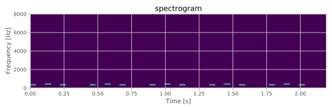

.. |as500| raw:: html

  <audio controls="controls">
    <source src="_static/auditory_streaming500.wav" type="audio/wav">
    Your browser does not support the <code>audio</code> element. 
  </audio>

.. |as600| raw:: html

  <audio controls="controls">
    <source src="_static/auditory_streaming600.wav" type="audio/wav">
    Your browser does not support the <code>audio</code> element. 
  </audio>

.. |as600img| image:: ./example/auditory_streaming600.png
  :scale: 25

======= ============ =========== ===========
audio    A tone [Hz] B tone [Hz] spectrogram
------- ------------ ----------- -----------
|as400|      315         400     |as400img|
------- ------------ ----------- -----------
|as500|      315         500     |as500img|
------- ------------ ----------- -----------
|as600|      315         600     |as600img|
======= ============ =========== ===========

The corresponding configuration of the first row is below:

.. toggle::

  .. code-block:: yaml

    # general setting
    stimulus-module: auditory_streaming
    samp-freq: 16000
    outdir: "data/auditory_streaming"
    suffix: pure_a315hz_b400hz
    
    # sounds setting
    sound-generation-pipeline: [pure_tone]
    pure-tone-num-signals: 2
    pure-tone-duration: [50, 50]
    pure-tone-freq: [315, 400]
    
    # stimulus setting
    # A-B-A,A-B-A,...
    num-repetition: 10
    ab-interval: 60
    aba-interval: 170
    ab-ramp-duration: 5
    
    # postprocessings setting
    postprocess-pipeline: [declip]
    declip-thres: 1
    
    # visualization
    visualization-pipeline: [spectrogram]
    visualization-outdir: "data/auditory_streaming/vis"
    visualization-temporal-limit: "0_2200"
    spectrogram-visualizer-scale: "linear"

--------

*******************
Continuity illusion
*******************

.. |cnt_rep| raw:: html

  <audio controls="controls">
    <source src="_static/cnt_replace.wav" type="audio/wav">
    Your browser does not support the <code>audio</code> element. 
  </audio>

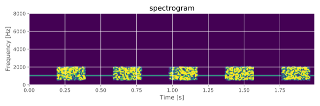

.. |cnt_ovl| raw:: html

  <audio controls="controls">
    <source src="_static/cnt_overlap.wav" type="audio/wav">
    Your browser does not support the <code>audio</code> element. 
  </audio>

.. |cnt_sil| raw:: html

  <audio controls="controls">
    <source src="_static/cnt_silent.wav" type="audio/wav">
    Your browser does not support the <code>audio</code> element. 
  </audio>

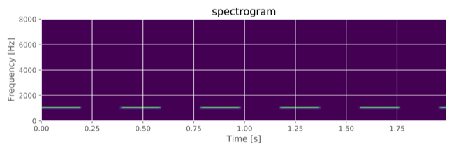

========= ========== ===========
audio     gap method spectrogram
--------- ---------- -----------
|cnt_rep|  replace   |cnt_repimg|
--------- ---------- -----------
|cnt_ovl|  overlap   |cnt_ovlimg|
--------- ---------- -----------
|cnt_sil|  silent    |cnt_silimg|
========= ========== ===========

The corresponding configuration of the first row is below:

.. toggle::

  .. code-block:: yaml

    # general setting
    stimulus-module: continuity
    samp-freq: 16000
    outdir: "data/continuity"
    suffix: replace_pure_tone
    seed: 1
    
    # sounds setting
    sound-generation-pipeline: [pure_tone, filtered_noise]
    # pure_tone setting
    pure-tone-duration: [5000]
    pure-tone-freq: [1000]
    pure-tone-num-signals: 1
    
    # filtered_nosie setting
    filtered-noise-duration: [5000]
    filtered-noise-btype: [bandpass]
    filtered-noise-filter-freq: ["500_2000"]
    filtered-noise-filter-impulse-response: [fir]
    filtered-noise-filter-order: [512]
    filtered-noise-filter-firwin: [hann]
    filtered-noise-num-signals: 1
    
    # stimulus setting
    target-duration: 200
    gap-duration: 200
    gap-method: replace
    gap-ramp-duration: 5
    target-snr: -14
    
    # postprocessings setting
    postprocess-pipeline: [declip, apply_ramp]
    declip-thres: 1
    apply-ramp-duration: 5
    apply-ramp-wfunction: hann
    apply-ramp-position: both
    
    # visualization
    visualization-pipeline: [spectrogram]
    visualization-outdir: "data/continuity/vis"
    visualization-temporal-limit: "0_2000"
    spectrogram-visualizer-scale: "linear"
    spectrogram-visualizer-vmax: 30000

--------

**********************
Iterated rippled noise
**********************

.. |irn_i8_d1| raw:: html

  <audio controls="controls">
    <source src="_static/irn_i8_d1.wav" type="audio/wav">
    Your browser does not support the <code>audio</code> element. 
  </audio>

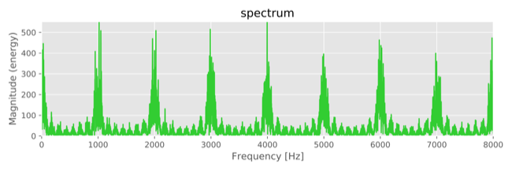

.. |irn_i4_d1| raw:: html

  <audio controls="controls">
    <source src="_static/irn_i4_d1.wav" type="audio/wav">
    Your browser does not support the <code>audio</code> element. 
  </audio>

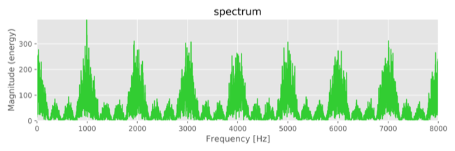

.. |irn_i2_d1| raw:: html

  <audio controls="controls">
    <source src="_static/irn_i2_d1.wav" type="audio/wav">
    Your browser does not support the <code>audio</code> element. 
  </audio>

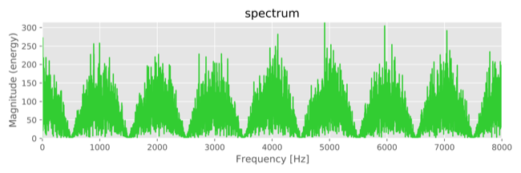

.. |irn_i1_d1| raw:: html

  <audio controls="controls">
    <source src="_static/irn_i1_d1.wav" type="audio/wav">
    Your browser does not support the <code>audio</code> element. 
  </audio>

.. |irn_i1_d1img| image:: ./example/irn_i1_d1.png
  :scale: 25

.. |irn_i8_d2| raw:: html

  <audio controls="controls">
    <source src="_static/irn_i8_d2.wav" type="audio/wav">
    Your browser does not support the <code>audio</code> element. 
  </audio>

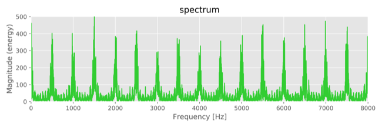

=========== ========= ========== ==============
audio       iteration delay [ms]    spectrum
----------- --------- ---------- --------------
|irn_i8_d1|   8         1        |irn_i8_d1img|
----------- --------- ---------- --------------
|irn_i4_d1|   4         1        |irn_i4_d1img|
----------- --------- ---------- --------------
|irn_i2_d1|   2         1        |irn_i2_d1img|
----------- --------- ---------- --------------
|irn_i1_d1|   1         1        |irn_i1_d1img|
----------- --------- ---------- --------------
|irn_i8_d2|   8         2        |irn_i8_d2img|
=========== ========= ========== ==============

The corresponding configuration of the first row is below:

.. toggle::

  .. code-block:: yaml

    # general setting
    stimulus-module: iterated_rippled_noise
    samp-freq: 16000
    outdir: "data/iterated_rippled_noise"
    suffix: iter8_delay1
    
    # sounds setting
    sound-generation-pipeline: [colored_noise]
    colored-noise-color: [white]
    colored-noise-duration: [1000]
    colored-noise-num-signals: 1
    
    # stimulus setting
    num-iteration: 8
    delay: 1
    
    # postprocessings setting
    postprocess-pipeline: [declip, apply_ramp]
    declip-thres: 1
    apply-ramp-duration: 5
    apply-ramp-wfunction: hann
    apply-ramp-position: both
    
    # visualization
    visualization-pipeline: [spectrum]
    visualization-outdir: "data/iterated_rippled_noise/vis"

--------

**************************************
Interaural phase difference/modulation
**************************************

.. |ipd0| raw:: html

  <audio controls="controls">
    <source src="_static/ipd0.wav" type="audio/wav">
    Your browser does not support the <code>audio</code> element.
  </audio>

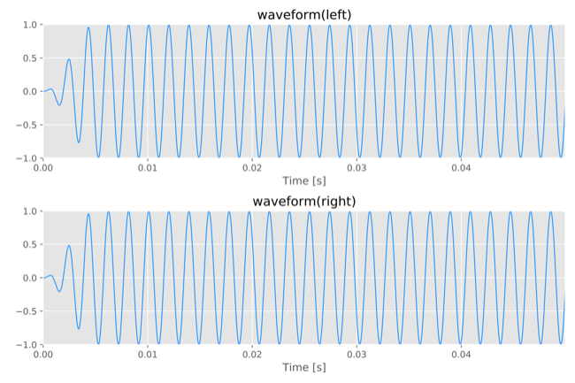

.. |ipd45| raw:: html

  <audio controls="controls">
    <source src="_static/ipd45.wav" type="audio/wav">
    Your browser does not support the <code>audio</code> element.
  </audio>

.. |ipd45img| image:: ./example/ipd45.png
  :scale: 15

.. |ipd90| raw:: html

  <audio controls="controls">
    <source src="_static/ipd90.wav" type="audio/wav">
    Your browser does not support the <code>audio</code> element.
  </audio>

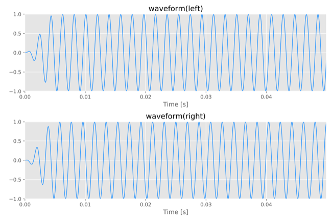

.. |ipd_45| raw:: html

  <audio controls="controls">
    <source src="_static/ipd_45.wav" type="audio/wav">
    Your browser does not support the <code>audio</code> element.
  </audio>

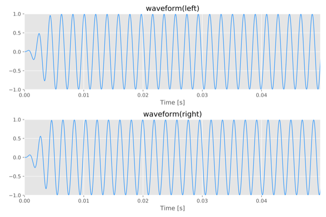

.. |ipd_90| raw:: html

  <audio controls="controls">
    <source src="_static/ipd_90.wav" type="audio/wav">
    Your browser does not support the <code>audio</code> element.
  </audio>

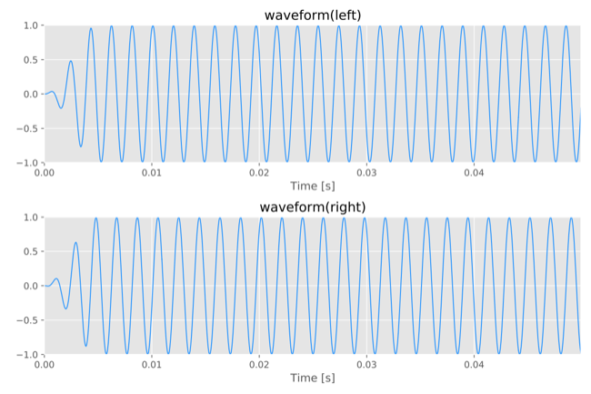

.. |ipm0| raw:: html

  <audio controls="controls">
    <source src="_static/ipm0.wav" type="audio/wav">
    Your browser does not support the <code>audio</code> element.
  </audio>

.. |ipm0img| image:: ./example/ipm0.png
  :scale: 15

.. |ipm45| raw:: html

  <audio controls="controls">
    <source src="_static/ipm45.wav" type="audio/wav">
    Your browser does not support the <code>audio</code> element.
  </audio>

.. |ipm45img| image:: ./example/ipm45.png
  :scale: 15

.. |ipm90| raw:: html

  <audio controls="controls">
    <source src="_static/ipm90.wav" type="audio/wav">
    Your browser does not support the <code>audio</code> element.
  </audio>

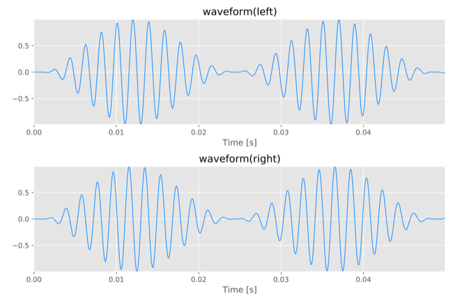

.. |ipm_45| raw:: html

  <audio controls="controls">
    <source src="_static/ipm_45.wav" type="audio/wav">
    Your browser does not support the <code>audio</code> element.
  </audio>

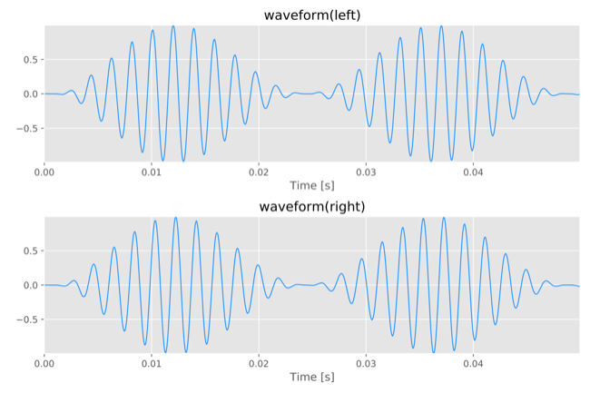

.. |ipm_90| raw:: html

  <audio controls="controls">
    <source src="_static/ipm_90.wav" type="audio/wav">
    Your browser does not support the <code>audio</code> element.
  </audio>

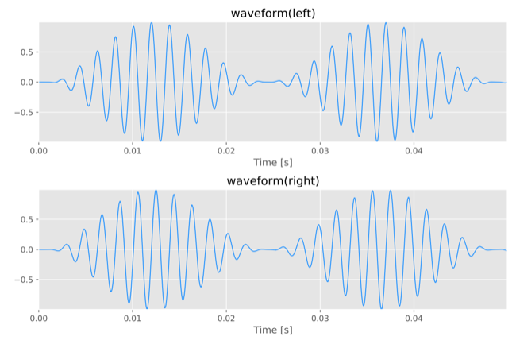

=========== ================= ==================== ==============
audio       right ear[degree] amplitude modulation    waveform
----------- ----------------- -------------------- --------------
|ipd0|              0                  \-            |ipd0img|
----------- ----------------- -------------------- --------------
|ipd45|            +45                 \-            |ipd45img|
----------- ----------------- -------------------- --------------
|ipd90|            +90                 \-            |ipd90img|
----------- ----------------- -------------------- --------------
|ipd_45|           -45                 \-           |ipd_45img|
----------- ----------------- -------------------- --------------
|ipd_90|           -90                 \-           |ipd_90img|
----------- ----------------- -------------------- --------------
|ipm0|              0                  ✓             |ipm0img|
----------- ----------------- -------------------- --------------
|ipm45|            +45                 ✓             |ipm45img|
----------- ----------------- -------------------- --------------
|ipm90|            +90                 ✓             |ipm90img|
----------- ----------------- -------------------- --------------
|ipm_45|           -45                 ✓            |ipm_45img|
----------- ----------------- -------------------- --------------
|ipm_90|           -90                 ✓            |ipm_90img|
=========== ================= ==================== ==============

The corresponding configuration of the second and seventh row is below:

.. toggle::

  .. code-block:: yaml
    :caption: second.conf

    # general setting
    stimulus-module: identity
    samp-freq: 16000
    outdir: "data/identity"
    suffix: interaural_phase_difference_deg45

    # sounds setting
    sound-generation-pipeline: [pure_tone]
    pure-tone-duration: [1000, 1000]
    pure-tone-freq: [520, 520]
    pure-tone-phase: [0, 45]
    pure-tone-num-signals: 2

    # stimuli setting
    binaural: True

    # postprocessings setting
    postprocess-pipeline: [apply_ramp]
    apply-ramp-duration: 5
    apply-ramp-wfunction: hann
    apply-ramp-position: both

    # visualization
    visualization-pipeline: [waveform]
    visualization-outdir: "data/identity/vis"
    visualization-temporal-limit: "0_50"

  .. code-block:: yaml
    :caption: seventh.conf

    # general setting
    stimulus-module: identity
    samp-freq: 16000
    outdir: "data/identity"
    suffix: interaural_phase_modulation_deg45

    # sounds setting
    sound-generation-pipeline: [am_tone]
    am-tone-duration: [1000, 1000]
    am-tone-freq: [520, 520]
    am-tone-phase: [0, 45]
    am-tone-modulation-freq: [41, 41]
    am-tone-modulator-phase: [0, 0]
    am-tone-depth: [100, 100]
    am-tone-num-signals: 2

    # stimuli setting
    binaural: True

    # postprocessings setting
    postprocess-pipeline: [apply_ramp]
    apply-ramp-duration: 5
    apply-ramp-wfunction: hann
    apply-ramp-position: both

    # visualization
    visualization-pipeline: [waveform]
    visualization-outdir: "data/identity/vis"
    visualization-temporal-limit: "0_50"