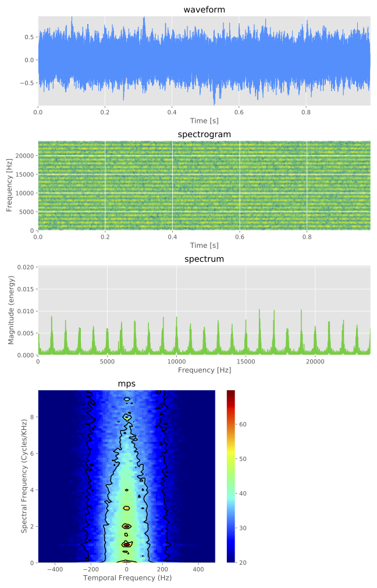
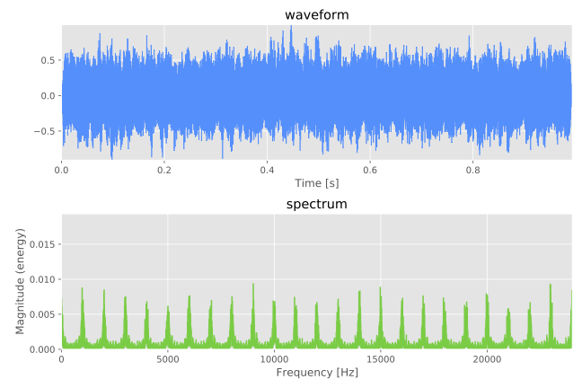

.. _vis:

#############
Visualization
#############

You can visualize output auditory signal optionally.
ASPEN is introduced to pipeline of plots (such as waveform, spectrum and so on).
If you already have run the iterated rippled noise (IRN) example (see :ref:`run_with_conf`), you can find the PDF ``data/iterated_rippled_noise/vis/iter8_delay1.pdf``:

--------

--------

The plots are defined by visualization section of configuration file such as:

.. code-block:: yaml

  # visualization
  visualization-pipeline: [waveform, spectrogram, spectrum, mps]
  visualization-outdir: "data/iterated_rippled_noise/vis"

.. note::
   
  The choice of visualization type can be confirmed by ``--visualization-pipeline`` arguments from the output of command such as ``generate.py --stimulus-module iterated_rippled_noise --help``

For example, the waveform and spectrum of the IRN are shown selectively if the configuration has been overwritten such as

.. code-block:: yaml

  # visualization
  visualization-pipeline: [waveform, spectrum]
  visualization-outdir: "data/iterated_rippled_noise/vis"

or the arguments have been overridden such as:

.. code-block:: bash

  generate.py --conf conf/iterated_rippled_noise.conf --visualization-pipeline waveform spectrum

The output PDF is:

--------

